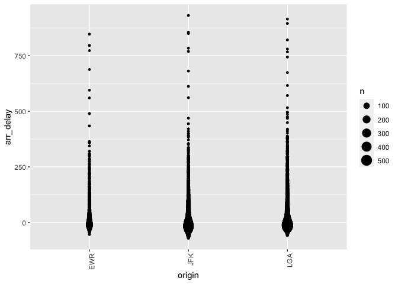
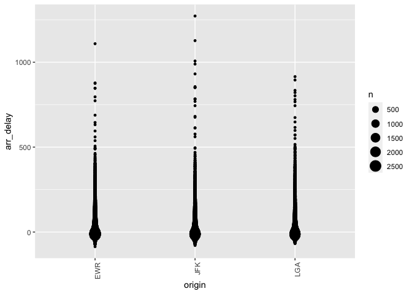

```r
#install and load packages
library(knitr)
library(nycflights13)
library(tidyverse)
```

```
## ── Attaching packages ─────────────────────────────────────── tidyverse 1.3.0 ──
```

```
## ✓ ggplot2 3.3.3     ✓ purrr   0.3.4
## ✓ tibble  3.0.5     ✓ dplyr   1.0.3
## ✓ tidyr   1.1.2     ✓ stringr 1.4.0
## ✓ readr   1.4.0     ✓ forcats 0.5.0
```

```
## ── Conflicts ────────────────────────────────────────── tidyverse_conflicts() ──
## x dplyr::filter() masks stats::filter()
## x dplyr::lag()    masks stats::lag()
```

```r
library(downloader)
library(readxl)
```

### Answer to Question 2
In order to determine which airport is the best to minimize chances of late arrivals, you can find the number of late arrivals per airport and look at which airport has the least amount of late arrivals. When inspecting the visualization below, we can tell that EWR has the least number of late arrivals. EWR is the best airport to minimize chances of late arrival.

```r
#investigate the database 
head(flights)
```

```
## # A tibble: 6 x 19
##    year month   day dep_time sched_dep_time dep_delay arr_time sched_arr_time
##   <int> <int> <int>    <int>          <int>     <dbl>    <int>          <int>
## 1  2013     1     1      517            515         2      830            819
## 2  2013     1     1      533            529         4      850            830
## 3  2013     1     1      542            540         2      923            850
## 4  2013     1     1      544            545        -1     1004           1022
## 5  2013     1     1      554            600        -6      812            837
## 6  2013     1     1      554            558        -4      740            728
## # … with 11 more variables: arr_delay <dbl>, carrier <chr>, flight <int>,
## #   tailnum <chr>, origin <chr>, dest <chr>, air_time <dbl>, distance <dbl>,
## #   hour <dbl>, minute <dbl>, time_hour <dttm>
```

```r
str(flights)
```

```
## tibble [336,776 × 19] (S3: tbl_df/tbl/data.frame)
##  $ year          : int [1:336776] 2013 2013 2013 2013 2013 2013 2013 2013 2013 2013 ...
##  $ month         : int [1:336776] 1 1 1 1 1 1 1 1 1 1 ...
##  $ day           : int [1:336776] 1 1 1 1 1 1 1 1 1 1 ...
##  $ dep_time      : int [1:336776] 517 533 542 544 554 554 555 557 557 558 ...
##  $ sched_dep_time: int [1:336776] 515 529 540 545 600 558 600 600 600 600 ...
##  $ dep_delay     : num [1:336776] 2 4 2 -1 -6 -4 -5 -3 -3 -2 ...
##  $ arr_time      : int [1:336776] 830 850 923 1004 812 740 913 709 838 753 ...
##  $ sched_arr_time: int [1:336776] 819 830 850 1022 837 728 854 723 846 745 ...
##  $ arr_delay     : num [1:336776] 11 20 33 -18 -25 12 19 -14 -8 8 ...
##  $ carrier       : chr [1:336776] "UA" "UA" "AA" "B6" ...
##  $ flight        : int [1:336776] 1545 1714 1141 725 461 1696 507 5708 79 301 ...
##  $ tailnum       : chr [1:336776] "N14228" "N24211" "N619AA" "N804JB" ...
##  $ origin        : chr [1:336776] "EWR" "LGA" "JFK" "JFK" ...
##  $ dest          : chr [1:336776] "IAH" "IAH" "MIA" "BQN" ...
##  $ air_time      : num [1:336776] 227 227 160 183 116 150 158 53 140 138 ...
##  $ distance      : num [1:336776] 1400 1416 1089 1576 762 ...
##  $ hour          : num [1:336776] 5 5 5 5 6 5 6 6 6 6 ...
##  $ minute        : num [1:336776] 15 29 40 45 0 58 0 0 0 0 ...
##  $ time_hour     : POSIXct[1:336776], format: "2013-01-01 05:00:00" "2013-01-01 05:00:00" ...
```

```r
?flights
view(flights)
```


```r
#Which origin aiport is best to minimize my chances of a late arrival when I am using Delta Airlines? 
Delta <- filter(flights, carrier == "DL", )

ggplot(Delta, aes(x = origin, y = arr_delay))+
  geom_count()+
    theme(axis.text.x=element_text(angle=90, hjust=1))
```

```
## Warning: Removed 452 rows containing non-finite values (stat_sum).
```

<!-- -->
### Answer to Question 3
In order to determine which airport is the worst for arrival times, it is helpful to view the number of delayed arrivals per airport. When this is done (shown in the visualization below) JFK has the most number of delayed arrivals per airport. 

```r
#Which airport is the worst airport for arrival time? 
ggplot(flights, aes(x = origin, y = arr_delay))+
  geom_count()+
    theme(axis.text.x=element_text(angle=90, hjust=1))
```

```
## Warning: Removed 9430 rows containing non-finite values (stat_sum).
```

<!-- -->


