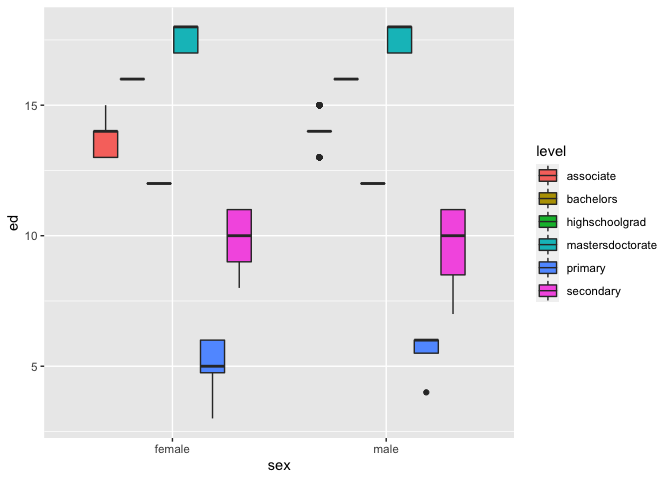

```r
library(tidyverse)
```

```
## ── Attaching packages ─────────────────────────────────────── tidyverse 1.3.0 ──
```

```
## ✓ ggplot2 3.3.3     ✓ purrr   0.3.4
## ✓ tibble  3.0.5     ✓ dplyr   1.0.3
## ✓ tidyr   1.1.2     ✓ stringr 1.4.0
## ✓ readr   1.4.0     ✓ forcats 0.5.0
```

```
## ── Conflicts ────────────────────────────────────────── tidyverse_conflicts() ──
## x dplyr::filter() masks stats::filter()
## x dplyr::lag()    masks stats::lag()
```


```r
#read in data

urlfile = "https://raw.githubusercontent.com/hadley/r4ds/master/data/heights.csv"
task8data <- read_csv(url(urlfile))
```

```
## 
## ── Column specification ────────────────────────────────────────────────────────
## cols(
##   earn = col_double(),
##   height = col_double(),
##   sex = col_character(),
##   ed = col_double(),
##   age = col_double(),
##   race = col_character()
## )
```


```r
#make a new data set called HeightEd with the following categories
head(task8data)
```

```
## # A tibble: 6 x 6
##    earn height sex       ed   age race 
##   <dbl>  <dbl> <chr>  <dbl> <dbl> <chr>
## 1 50000   74.4 male      16    45 white
## 2 60000   65.5 female    16    58 white
## 3 30000   63.6 female    16    29 white
## 4 50000   63.1 female    16    91 other
## 5 51000   63.4 female    17    39 white
## 6  9000   64.4 female    15    26 white
```

```r
tail(task8data)
```

```
## # A tibble: 6 x 6
##    earn height sex       ed   age race 
##   <dbl>  <dbl> <chr>  <dbl> <dbl> <chr>
## 1 10000   70.1 female    16    36 white
## 2 19000   72.2 male      12    29 white
## 3 15000   61.1 female    18    82 white
## 4  8000   63.7 female    12    33 white
## 5 60000   71.9 male      12    50 white
## 6  6000   68.4 male      12    27 white
```

```r
str(task8data)
```

```
## tibble [1,192 × 6] (S3: spec_tbl_df/tbl_df/tbl/data.frame)
##  $ earn  : num [1:1192] 50000 60000 30000 50000 51000 9000 29000 32000 2000 27000 ...
##  $ height: num [1:1192] 74.4 65.5 63.6 63.1 63.4 ...
##  $ sex   : chr [1:1192] "male" "female" "female" "female" ...
##  $ ed    : num [1:1192] 16 16 16 16 17 15 12 17 15 12 ...
##  $ age   : num [1:1192] 45 58 29 91 39 26 49 46 21 26 ...
##  $ race  : chr [1:1192] "white" "white" "white" "other" ...
##  - attr(*, "spec")=
##   .. cols(
##   ..   earn = col_double(),
##   ..   height = col_double(),
##   ..   sex = col_character(),
##   ..   ed = col_double(),
##   ..   age = col_double(),
##   ..   race = col_character()
##   .. )
```

```r
HeightEd <- task8data %>% 
  mutate(level=
  case_when(
  ed >= 3 & ed <= 6 ~ "primary",
  ed >= 7 & ed <= 11 ~ "secondary",
  ed  == 12 ~ "highschoolgrad",
  ed >= 13 & ed <= 15 ~ "associate",
  ed == 16 ~ "bachelors",
  ed >= 17 & ed <= 18 ~ "mastersdoctorate"
))
head(HeightEd)
```

```
## # A tibble: 6 x 7
##    earn height sex       ed   age race  level           
##   <dbl>  <dbl> <chr>  <dbl> <dbl> <chr> <chr>           
## 1 50000   74.4 male      16    45 white bachelors       
## 2 60000   65.5 female    16    58 white bachelors       
## 3 30000   63.6 female    16    29 white bachelors       
## 4 50000   63.1 female    16    91 other bachelors       
## 5 51000   63.4 female    17    39 white mastersdoctorate
## 6  9000   64.4 female    15    26 white associate
```


```r
#make a graphic to show the relationship between education and race.
str(HeightEd)
```

```
## tibble [1,192 × 7] (S3: spec_tbl_df/tbl_df/tbl/data.frame)
##  $ earn  : num [1:1192] 50000 60000 30000 50000 51000 9000 29000 32000 2000 27000 ...
##  $ height: num [1:1192] 74.4 65.5 63.6 63.1 63.4 ...
##  $ sex   : chr [1:1192] "male" "female" "female" "female" ...
##  $ ed    : num [1:1192] 16 16 16 16 17 15 12 17 15 12 ...
##  $ age   : num [1:1192] 45 58 29 91 39 26 49 46 21 26 ...
##  $ race  : chr [1:1192] "white" "white" "white" "other" ...
##  $ level : chr [1:1192] "bachelors" "bachelors" "bachelors" "bachelors" ...
##  - attr(*, "spec")=
##   .. cols(
##   ..   earn = col_double(),
##   ..   height = col_double(),
##   ..   sex = col_character(),
##   ..   ed = col_double(),
##   ..   age = col_double(),
##   ..   race = col_character()
##   .. )
```

```r
#initial graphic
plot1 <- ggplot(HeightEd, aes(x = race, y = ed, fill = level)) +
  geom_boxplot()
plot1
```

<!-- -->


```r
#make another graphic to show the relationship between education and sex
plot2 <- ggplot(HeightEd, aes(x = sex, y = ed, fill = level)) +
  geom_boxplot()
plot2
```

<!-- -->


```r
#make another graph that incorporates good labels... etc.
plot3 <- ggplot(HeightEd, aes(x = sex, y = ed, fill = level)) +
  geom_col()
print(plot3 + ggtitle("Relationship Between Sex and Education"))
```

<!-- -->

```r
plot3
```

<!-- -->

It is a lot easier to work with and understand column/bar graphs than box plots. Organizing them with data makes a lot more sense. 
